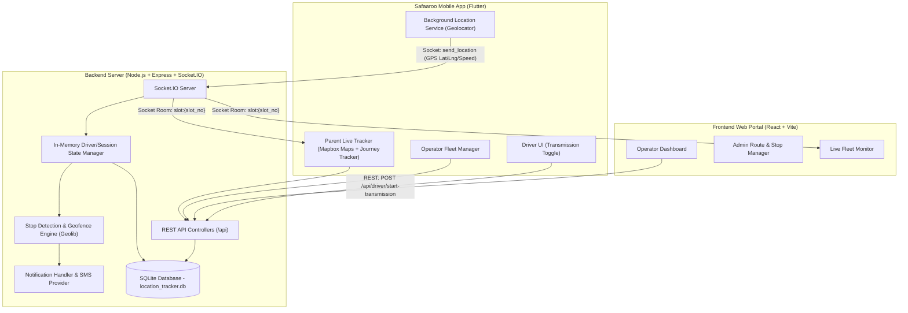
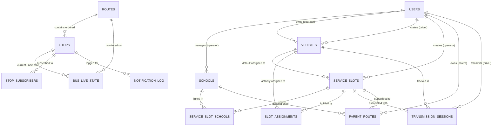
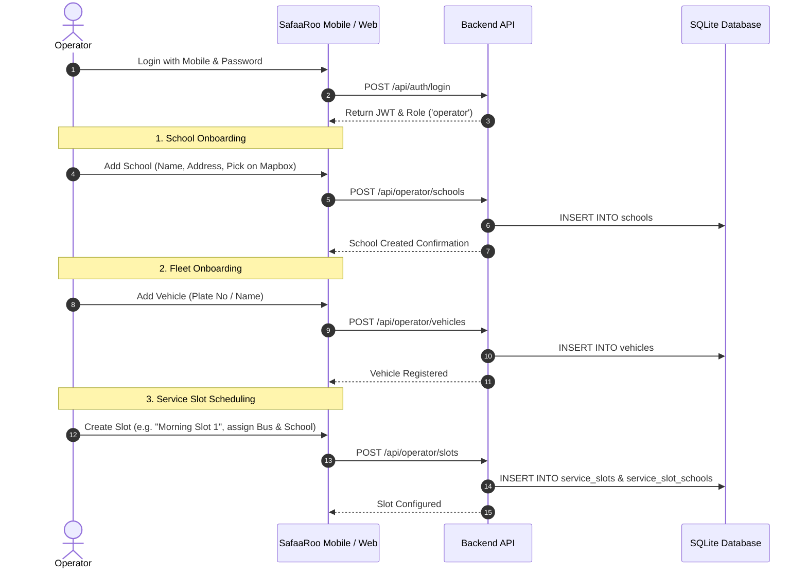
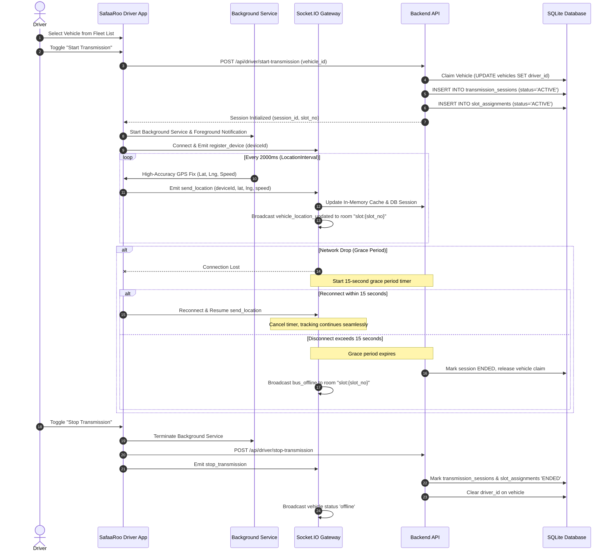
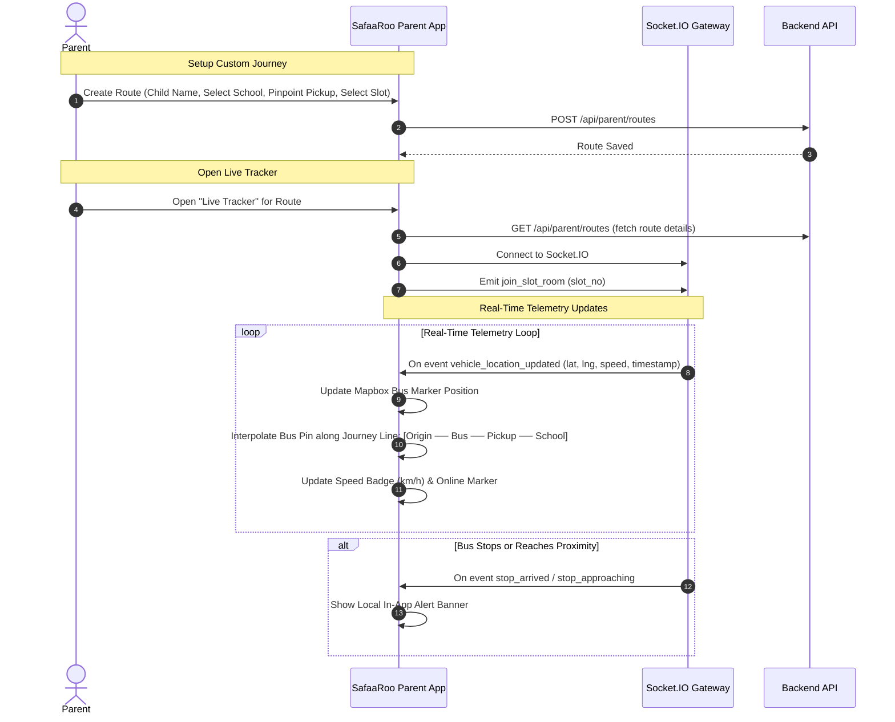
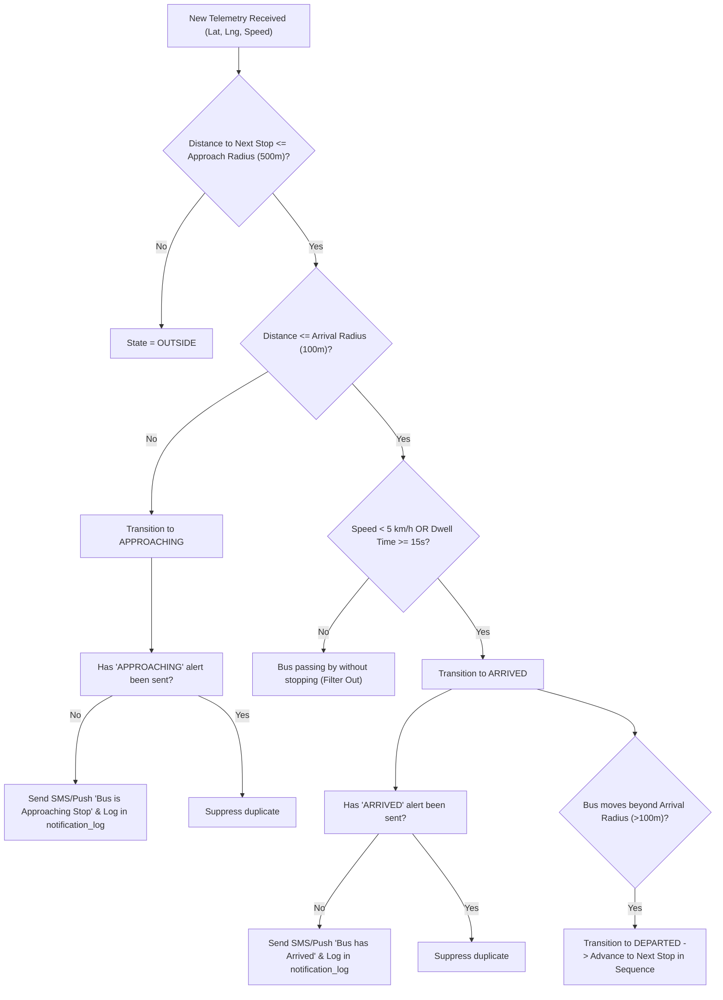

# SafaaRoo — Comprehensive System Architecture & Workflow Specification

> **SafaaRoo** is an intelligent, real-time school transportation tracking platform built with a high-performance **Node.js/Socket.IO** backend, an administrative **React** web dashboard, and a feature-rich cross-platform **Flutter** mobile application for drivers, parents, and fleet operators.

---

## Table of Contents
1. [Core Architectural Tenet](#1-core-architectural-tenet)
2. [High-Level System Architecture](#2-high-level-system-architecture)
3. [Folder Breakdown & Internal Architecture](#3-folder-breakdown--internal-architecture)
   - [3.1 Backend (`/backend`)](#31-backend-backend)
   - [3.2 Web Frontend (`/frontend`)](#32-web-frontend-frontend)
   - [3.3 Flutter Mobile App (`/Safaaroo`)](#33-flutter-mobile-app-safaaroo)
4. [Database Architecture & Schema (SQLite)](#4-database-architecture--schema-sqlite)
   - [Entity-Relationship Diagram](#entity-relationship-diagram)
   - [Table Specifications](#table-specifications)
5. [End-to-End System Workflows](#5-end-to-end-system-workflows)
   - [Role 1: Fleet Operator Workflow](#role-1-fleet-operator-workflow)
   - [Role 2: Driver Telemetry & Transmission Workflow](#role-2-driver-telemetry--transmission-workflow)
   - [Role 3: Parent Route Mapping & Live Tracking Workflow](#role-3-parent-route-mapping--live-tracking-workflow)
   - [Engine: Stop Detection & Proximity Alerting Engine](#engine-stop-detection--proximity-alerting-engine)
6. [Real-Time Telemetry Sequence Diagrams](#6-real-time-telemetry-sequence-diagrams)
7. [Environment Configuration & Running the Project](#7-environment-configuration--running-the-project)

---

## 1. Core Architectural Tenet

In conventional fleet trackers, a vehicle is tightly bound to a specific driver, school, or static route. **SafaaRoo decouples assets using a Dynamic Assignment Model**:

```
[Physical Bus Asset]  ──(Claimed by Driver)──>  [Transmission Session]
                                                        │
                                                        ▼
[Parent Custom Route] ──(Subscribed to)───────>  [Service Slot] (e.g., Morning Shift #1)
```

- **Vehicles (Buses) are independent tracking assets**: A bus is not hardcoded to a parent, student, or school.
- **Service Slots represent logical transport contracts**: e.g., "Morning Slot 1" or "Afternoon Pickup". Multiple schools can share a service slot.
- **Dynamic Slot Assignment**: When a driver selects a vehicle and starts transmitting GPS, the system binds that active bus to the scheduled **Service Slot**.
- **Parent Custom Journey Mapping**: Parents subscribe to a Service Slot and define their own personalized journey:
  $$\text{Origin / Start} \longrightarrow \text{Parent Pickup Point} \longrightarrow \text{School}$$
  The parent receives live bus telemetry over the slot channel regardless of which physical vehicle or driver is operating the shift that day.

---

## 2. High-Level System Architecture



---

## 3. Folder Breakdown & Internal Architecture

```
location-tracker-poc/
├── backend/       # Node.js API server, Socket.IO gateway, SQLite database, geofence engine
├── frontend/      # React 18 + Vite web dashboard for operators and fleet administrators
├── Safaaroo/      # Flutter cross-platform mobile application for Drivers, Parents, Operators
├── docs/          # Detailed architectural and API documentation files
├── .gitignore     # Root Git configuration ignoring secrets, build artifacts, databases
└── README.md      # Master documentation file
```

---

### 3.1 Backend (`/backend`)

The backend is built with **Node.js, Express, Socket.IO, and SQLite3**. It acts as the central authority for authentication, asset claiming, dynamic slot assignments, real-time GPS telemetry routing, and proximity detection.

#### Directory Tree
```
backend/
├── config/
│   └── db.js                        # SQLite schema initialization, table migrations & connection
├── controllers/
│   ├── authController.js            # Login, registration, role checks, password hashing
│   ├── deviceController.js          # Device status and push subscriptions
│   ├── driverController.js          # Vehicle history, claim vehicle, start/stop transmission
│   ├── locationController.js        # Historical location queries
│   ├── operatorController.js        # School, vehicle, and service slot management
│   ├── parentController.js          # Parent profiles and multi-route management
│   └── routeController.js           # Administrative routes and static stop management
├── middleware/
│   └── auth.js                      # JWT authentication and role-based access control (RBAC)
├── routes/                          # Express REST route definitions
│   ├── authRoutes.js
│   ├── deviceRoutes.js
│   ├── driverRoutes.js
│   ├── locationRoutes.js
│   ├── operatorRoutes.js
│   ├── parentRoutes.js
│   └── routeRoutes.js
├── services/
│   ├── geo.js                       # Distance calculations using Geolib
│   ├── notificationHandler.js       # Notification dispatching and deduplication
│   ├── smsProvider.js               # External SMS gateway integration (Fast2SMS / Twilio)
│   ├── stopDb.js                    # Database operations for stops and live states
│   └── stopDetection.js             # Dwell time, radius geofencing, speed threshold engine
├── sockets/
│   ├── locationSocket.js            # Real-time GPS stream handler, room broadcasts & grace period
│   └── smsSocket.js                 # Socket events for SMS notification triggers
├── src/
│   └── app.js                       # Express app configuration, CORS, middleware assembly
├── scripts/                         # Seed scripts, migrations, GPS simulators
└── server.js                        # HTTP & Socket.IO server entry point (Port 5000)
```

#### Core Modules & Responsibilities
- **`config/db.js`**: Initializes SQLite database (`location_tracker.db`), executes DDL table creation statements, runs automatic non-destructive column migrations (e.g., adding `slot_no`, `custom_school_name`, `pickup_name`), and ensures foreign key support.
- **`sockets/locationSocket.js`**:
  - Handles socket connections from Drivers, Parents, and Admins.
  - Receives `send_location` from drivers: updates `devices` table, updates `transmission_sessions` with current coordinates, resolves which `slot_no` the vehicle is assigned to, and emits `vehicle_location_updated` to the room `slot:{slot_no}`.
  - Manages **15-Second Disconnect Grace Period**: If a driver's network drops, the server holds the session for 15 seconds. If the driver reconnects, tracking resumes seamlessly; if timeout expires, the session is cleanly terminated and the vehicle is unassigned.
- **`services/stopDetection.js`**: Evaluates live telemetry against predefined stops. Implements a 4-state state machine (`OUTSIDE` -> `APPROACHING` -> `ARRIVED` -> `DEPARTED`) with radius thresholds (500m approach, 100m arrival) and speed/dwell filters to avoid false triggers at traffic lights.

#### Key REST Endpoints
| Method | Endpoint | Access | Purpose |
|---|---|---|---|
| `POST` | `/api/auth/login` | Public | Authenticates user (Operator / Driver / Parent) and returns JWT token |
| `POST` | `/api/auth/register` | Public | Registers a new user account with specified role |
| `GET` | `/api/operator/schools` | Operator | Lists all schools created by operator |
| `POST` | `/api/operator/schools` | Operator | Creates a new school with GPS coordinates |
| `GET` | `/api/operator/vehicles` | Operator | Lists all operator vehicles with status & driver assignments |
| `POST` | `/api/operator/vehicles` | Operator | Adds a new vehicle |
| `GET` | `/api/operator/slots` | Operator | Lists all service slots with linked schools and default vehicles |
| `POST` | `/api/operator/slots` | Operator | Creates a new service slot |
| `POST` | `/api/driver/claim-vehicle` | Driver | Associates a driver with a specific vehicle |
| `POST` | `/api/driver/start-transmission`| Driver | Initiates transmission session, binds vehicle to slot |
| `POST` | `/api/driver/stop-transmission` | Driver | Ends transmission session, marks slot inactive |
| `GET` | `/api/parent/routes` | Parent | Retrieves all configured custom routes for parent |
| `POST` | `/api/parent/routes` | Parent | Creates a custom journey route (Pickup point, School, Slot) |

---

### 3.2 Web Frontend (`/frontend`)

The web application is built with **React 18, Vite, and Tailwind/Vanilla CSS**, providing a browser-based operations portal for desktop control.

#### Directory Tree
```
frontend/
├── public/
│   ├── favicon.svg
│   ├── icons.svg
│   └── sw.js                        # Service Worker for Web Push notifications
├── src/
│   ├── assets/                      # SVG icons and branding assets
│   ├── context/
│   │   ├── AuthContext.jsx          # JWT authentication state & login/logout handlers
│   │   └── UserContext.jsx          # Current user profile and role metadata
│   ├── pages/
│   │   ├── driver/
│   │   │   └── DriverDashboard.jsx  # Web-based driver controls
│   │   ├── operator/
│   │   │   ├── AddSchoolModal.jsx   # Modal for adding school coordinates
│   │   │   ├── AddVehicleModal.jsx  # Modal for adding fleet vehicles
│   │   │   └── OperatorDashboard.jsx# Main operator overview
│   │   ├── parent/
│   │   │   ├── LiveTracker.jsx      # Web live map tracking bus
│   │   │   ├── ParentDashboard.jsx  # Parent dashboard & active route list
│   │   │   └── RouteManager.jsx     # Route creation & pickup point configuration
│   │   ├── AdminRouteManager.jsx    # Administrative stop & geofence configuration
│   │   ├── BusTracker.jsx           # Multi-bus fleet monitor
│   │   ├── Home.jsx                 # Landing page
│   │   ├── Login.jsx                # Multi-role authentication page
│   │   ├── Receiver.jsx             # Dedicated telemetry receiving test panel
│   │   └── Transmitter.jsx          # GPS transmission simulator for development
│   ├── services/
│   │   ├── api.js                   # Axios HTTP client with auth interceptors
│   │   └── socket.js                # Singleton Socket.IO client instance
│   ├── App.jsx                      # Route definitions and layout wrapper
│   ├── main.jsx                     # Application bootstrap
│   └── index.css                    # Design system styles
├── package.json
└── vite.config.js
```

#### Key Capabilities
- **Operator Fleet Overview**: Real-time summary of registered schools, buses, and service slots.
- **Route & Stop Management**: Allows administrators to place stops on a map, adjust approach (500m) and arrival (100m) radii, and reorder sequence numbers.
- **Web Transmitter/Receiver Simulator**: Built-in developer utility to simulate moving GPS coordinates without needing physical mobile devices.

---

### 3.3 Flutter Mobile App (`/Safaaroo`)

The mobile application is built using **Flutter and Dart** with the **Provider** state management pattern. It targets Android and iOS and serves all three primary users with role-tailored user interfaces.

#### Directory Tree
```
Safaaroo/lib/
├── config/
│   └── app_config.dart              # Base URLs, Mapbox token, timeouts, storage keys
├── models/
│   ├── driver_profile.dart          # Driver data model
│   ├── parent_route.dart            # Parent custom route model (Origin, Pickup, School)
│   ├── school.dart                  # School entity model
│   ├── service_slot.dart            # Service slot entity model
│   ├── user.dart                    # Authenticated user & role model
│   └── vehicle.dart                 # Vehicle entity model
├── providers/
│   └── auth_provider.dart           # Authentication state, JWT persistence & role routing
├── screens/
│   ├── driver/
│   │   ├── driver_vehicle_detail_screen.dart  # Transmission toggle, speed display, live status
│   │   └── driver_vehicle_list_screen.dart    # Vehicle selection & historical list
│   ├── operator/
│   │   ├── add_school_modal.dart              # School creation with Mapbox map picker
│   │   ├── add_vehicle_modal.dart             # Bus creation modal
│   │   ├── create_slot_modal.dart             # Slot scheduling and school mapping modal
│   │   ├── edit_slot_modal.dart               # Slot editing modal
│   │   ├── operator_dashboard.dart            # Operator statistics, fleet list, slots list
│   │   └── pinpoint_location_modal.dart       # Interactive Mapbox coordinate picker
│   ├── parent/
│   │   ├── add_route_modal.dart               # Custom route setup (Pickup point, School, Slot)
│   │   ├── parent_dashboard.dart              # Parent route list with real-time status badges
│   │   └── route_live_tracker_screen.dart     # Interactive Live Tracker with 3-Point Journey
│   └── login_screen.dart                      # Tabbed/Role-based login interface
├── services/
│   ├── api_service.dart             # HTTP client using Dio/http with JWT headers
│   ├── background_service.dart      # flutter_background_service for ongoing background GPS
│   ├── location_service.dart        # Geolocator stream listener
│   ├── mapbox_service.dart          # Mapbox Geocoding & reverse geocoding API client
│   ├── notification_service.dart    # flutter_local_notifications for local mobile alerts
│   └── socket_service.dart          # Resilient Socket.IO client with room subscriptions
├── theme/
│   └── app_theme.dart               # Colors, typography, input decorations, card themes
├── app_router.dart                  # Screen navigation and routing logic
└── main.dart                        # Flutter initialization, Mapbox token setup & Provider scope
```

#### Key Modules & Features
- **Background Telemetry Transmission (`background_service.dart`)**:
  - Uses `flutter_background_service` and `geolocator` to keep the GPS transmission active even when the driver locks the screen or minimizes the app.
  - Maintains a persistent Android Foreground Notification ("SafaaRoo Driver — Transmitting Location").
- **Interactive Parent Live Tracker (`route_live_tracker_screen.dart`)**:
  - Displays Mapbox map centered on the vehicle and route.
  - **3-Point Journey Tracker UI**:
    $$\text{ORIGIN} \quad \rule[0.5ex]{4em}{1.5pt} \quad \text{PICKUP POINT} \quad \rule[0.5ex]{4em}{1.5pt} \quad \text{SCHOOL}$$
  - Dynamic Bus Pin interpolates smoothly along the journey path based on live GPS coordinates and speed.
  - Displays vehicle metrics: Driver name, current speed (km/h), last updated timestamp, and live connection indicator.

---

## 4. Database Architecture & Schema (SQLite)

The database file resides at `backend/location_tracker.db` (or `backend/dev.db` depending on environment configuration).

### Entity-Relationship Diagram



---

### Table Specifications

#### 1. `users`
Stores all registered accounts across roles.
| Column | Type | Constraints | Description |
|---|---|---|---|
| `user_id` | TEXT | PRIMARY KEY | Unique UUID or generated ID |
| `name` | TEXT | NOT NULL | Full name of user |
| `mobile` | TEXT | NOT NULL UNIQUE | Mobile phone number (used for login) |
| `password` | TEXT | NOT NULL | Salted bcrypt hash |
| `role` | TEXT | NOT NULL | `operator`, `driver`, or `parent` |
| `created_at` | TEXT | DEFAULT CURRENT_TIMESTAMP | Registration timestamp |

#### 2. `schools`
Educational institutions registered by fleet operators.
| Column | Type | Constraints | Description |
|---|---|---|---|
| `school_id` | TEXT | PRIMARY KEY | Unique school identifier |
| `operator_id` | TEXT | NOT NULL, FK(`users.user_id`) | Operator who registered the school |
| `school_name` | TEXT | NOT NULL | Display name of the school |
| `latitude` | REAL | NOT NULL | Latitude coordinates |
| `longitude` | REAL | NOT NULL | Longitude coordinates |
| `address` | TEXT | NULLABLE | Physical street address |
| `created_at` | TEXT | DEFAULT CURRENT_TIMESTAMP | Creation timestamp |

#### 3. `vehicles`
Physical bus assets managed by operators.
| Column | Type | Constraints | Description |
|---|---|---|---|
| `vehicle_id` | TEXT | PRIMARY KEY | Vehicle plate number or identifier |
| `operator_id` | TEXT | NOT NULL, FK(`users.user_id`) | Fleet operator owner |
| `driver_id` | TEXT | NULLABLE, FK(`users.user_id`) | Current driver holding the vehicle claim |
| `school_id` | TEXT | NULLABLE, FK(`schools.school_id`)| Primary associated school (optional) |
| `vehicle_name`| TEXT | NULLABLE | Friendly name (e.g. "Bus 04 - North Route") |
| `status` | TEXT | DEFAULT 'inactive' | Status (`active`, `inactive`) |
| `created_at` | TEXT | DEFAULT CURRENT_TIMESTAMP | Creation timestamp |

#### 4. `service_slots`
Logical transportation schedules created by operators.
| Column | Type | Constraints | Description |
|---|---|---|---|
| `slot_no` | INTEGER | PRIMARY KEY AUTOINCREMENT | Numeric slot identifier (e.g., 1, 2, 3) |
| `slot_name` | TEXT | NULLABLE | Friendly label (e.g., "Morning Slot 1") |
| `operator_id` | TEXT | NOT NULL, FK(`users.user_id`) | Fleet operator owner |
| `vehicle_id` | TEXT | UNIQUE, FK(`vehicles.vehicle_id`) | Default bus assigned to this slot |
| `created_at` | TEXT | DEFAULT CURRENT_TIMESTAMP | Creation timestamp |

#### 5. `service_slot_schools`
Many-to-many relationship mapping service slots to participating schools.
| Column | Type | Constraints | Description |
|---|---|---|---|
| `slot_no` | INTEGER | NOT NULL, FK(`service_slots.slot_no`) | Reference to service slot |
| `school_id` | TEXT | NOT NULL, FK(`schools.school_id`) | Reference to school |
| *Composite PK* | - | PRIMARY KEY (`slot_no`, `school_id`) | Ensures unique slot-school pairs |

#### 6. `slot_assignments`
Dynamic binding of a physical bus and driver to a service slot during an active shift.
| Column | Type | Constraints | Description |
|---|---|---|---|
| `assignment_id` | TEXT | PRIMARY KEY | Unique assignment UUID |
| `slot_no` | INTEGER | NOT NULL, FK(`service_slots.slot_no`) | Service slot being fulfilled |
| `vehicle_id` | TEXT | NOT NULL, FK(`vehicles.vehicle_id`) | Physical vehicle operating the slot |
| `driver_id` | TEXT | NULLABLE, FK(`users.user_id`) | Driver executing the route |
| `status` | TEXT | DEFAULT 'ACTIVE' | `ACTIVE` or `ENDED` |
| `assigned_at` | TEXT | DEFAULT CURRENT_TIMESTAMP | Start of assignment |
| `ended_at` | TEXT | NULLABLE | End of assignment |

#### 7. `transmission_sessions`
Audit log and real-time state of an ongoing GPS transmission session.
| Column | Type | Constraints | Description |
|---|---|---|---|
| `session_id` | TEXT | PRIMARY KEY | Unique session UUID |
| `driver_id` | TEXT | NOT NULL, FK(`users.user_id`) | Driver transmitting GPS |
| `vehicle_id` | TEXT | NOT NULL, FK(`vehicles.vehicle_id`) | Transmitting vehicle |
| `slot_no` | INTEGER | NULLABLE, FK(`service_slots.slot_no`)| Associated service slot |
| `device_id` | TEXT | NULLABLE | Associated device identifier |
| `status` | TEXT | DEFAULT 'ACTIVE' | `ACTIVE` or `ENDED` |
| `started_at` | TEXT | DEFAULT CURRENT_TIMESTAMP | Session initiation timestamp |
| `ended_at` | TEXT | NULLABLE | Session termination timestamp |
| `last_lat` | REAL | NULLABLE | Most recent latitude |
| `last_lng` | REAL | NULLABLE | Most recent longitude |
| `last_speed` | REAL | NULLABLE | Most recent speed in km/h |
| `last_update` | TEXT | NULLABLE | ISO timestamp of last received packet |

#### 8. `parent_routes`
Custom journey maps personalized by each parent.
| Column | Type | Constraints | Description |
|---|---|---|---|
| `route_id` | TEXT | PRIMARY KEY | Unique route UUID |
| `user_id` | TEXT | NOT NULL, FK(`users.user_id`) | Parent account owner |
| `route_name` | TEXT | NOT NULL | Custom label (e.g. "Aarav's School Bus") |
| `slot_no` | INTEGER | NULLABLE, FK(`service_slots.slot_no`)| Subscribed service slot |
| `school_id` | TEXT | NULLABLE, FK(`schools.school_id`)| Selected school |
| `pickup_name` | TEXT | NULLABLE | Custom name of the pickup location |
| `home_lat` | REAL | NULLABLE | Pickup point latitude |
| `home_lng` | REAL | NULLABLE | Pickup point longitude |
| `custom_school_name` | TEXT | NULLABLE | Custom school name override |
| `custom_school_lat` | REAL | NULLABLE | Custom school latitude override |
| `custom_school_lng` | REAL | NULLABLE | Custom school longitude override |
| `notify_pref` | TEXT | DEFAULT 'none' | Notification preference (`sms`, `push`, `none`) |
| `created_at` | TEXT | DEFAULT CURRENT_TIMESTAMP | Route creation timestamp |

#### 9. Core & Stop Tracking Tables
- **`devices`**: Tracks raw socket client states (`device_id`, `status` online/offline, `is_transmitting`, `push_subscription`).
- **`routes` & `stops`**: Defines ordered stops (`sequence_no`, `approach_radius_m` = 500m, `arrival_radius_m` = 100m).
- **`bus_live_state`**: State machine per bus (`OUTSIDE`, `APPROACHING`, `ARRIVED`, `DEPARTED`, `speed`, `current_stop_id`, `next_stop_id`).
- **`notification_log`**: Prevents duplicate alerts via `UNIQUE(bus_id, stop_id, event_type)`.
- **`stop_subscribers`**: Phone numbers subscribed to specific stop arrival alerts.

---

## 5. End-to-End System Workflows

### Role 1: Fleet Operator Workflow


---

### Role 2: Driver Telemetry & Transmission Workflow


---

### Role 3: Parent Route Mapping & Live Tracking Workflow


---

### Engine: Stop Detection & Proximity Alerting Engine

The backend runs a continuous stop detection engine on every GPS telemetry coordinate:



---

## 6. Real-Time Telemetry Sequence Diagrams

### Telemetry Propagation & Fan-Out

```
Driver Device (GPS)
    │
    │  1. Socket.IO: 'send_location' { lat, lng, speed, deviceId }
    ▼
Socket.IO Gateway (locationSocket.js)
    │
    ├──> 2. Query Active Session: resolveSlotNo(deviceId)
    │
    ├──> 3. Update SQLite: transmission_sessions (last_lat, last_lng, last_speed)
    │
    ├──> 4. Run Stop Detection Engine (services/stopDetection.js)
    │         └── If inside geofence: emit stop_alert / trigger SMS
    │
    │  5. Socket Fan-Out: emit 'vehicle_location_updated'
    │     to Room: "slot:{slot_no}"
    ├─────────────────────────────────┬───────────────────────────────┐
    ▼                                 ▼                               ▼
Parent Mobile #1               Parent Mobile #2                Admin Web Portal
(Updates Map & 3-Point UI)     (Updates Map & 3-Point UI)      (Updates Live Monitor)
```

---

## 7. Environment Configuration & Running the Project

### Prerequisites
- **Node.js**: v18.x or v20.x
- **Flutter SDK**: 3.x with Android SDK / Xcode configured
- **Mapbox Account**: Public Access Token for map rendering

---

### Step 1: Backend Setup
```bash
cd backend
npm install

# Configure environment variables
cp .env.example .env
```

Edit `backend/.env`:
```env
PORT=5000
JWT_SECRET=your_super_secret_jwt_key_here
SQLITE_DB_PATH=./location_tracker.db
FAST2SMS_API_KEY=your_optional_sms_key
```

Start the backend:
```bash
npm start
# Server listens on http://localhost:5000
# SQLite database initializes automatically at backend/location_tracker.db
```

---

### Step 2: Web Frontend Setup
```bash
cd frontend
npm install
npm run dev
# Vite dev server runs at http://localhost:5173
```

---

### Step 3: Flutter Mobile App Setup
```bash
cd Safaaroo
flutter pub get
```

Set your Mapbox token and backend URL in [app_config.dart](file:///e:/Project/tracking_system/location-tracker-poc%20(main)%20-%20Copy/Safaaroo/lib/config/app_config.dart):
- For Android Emulator: `http://10.0.2.2:5000`
- For Physical Device on Wi-Fi: `http://192.168.x.x:5000`
- For Public Tunnel: `https://your-tunnel.ngrok-free.dev`

Run the mobile app:
```bash
# Pass your Mapbox token via --dart-define or directly in app_config.dart
flutter run --dart-define=MAPBOX_ACCESS_TOKEN=pk.your_mapbox_token_here
```

---

### Default Roles & Test Credentials
When testing with newly created users:
- **Operator**: Registers schools, adds vehicles, creates service slots.
- **Driver**: Claims an operator vehicle, toggles transmission on/off.
- **Parent**: Creates custom routes linked to the service slot and watches the live bus pin move in real-time.
